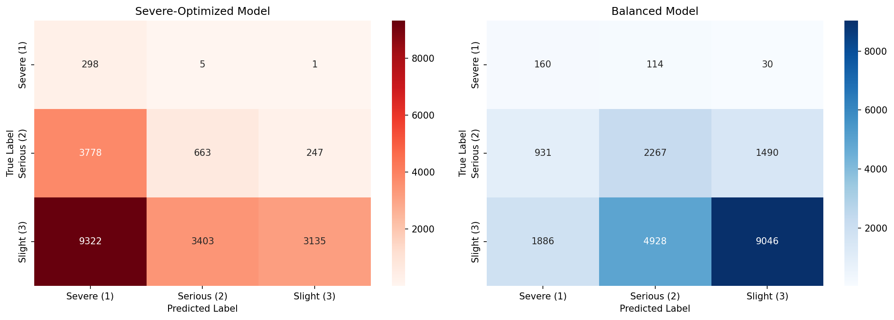
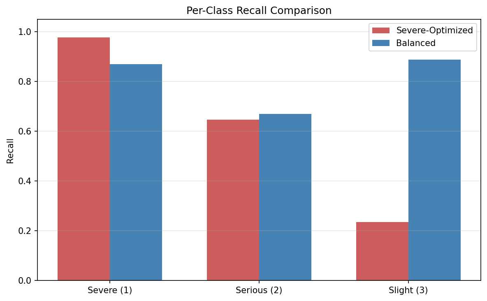
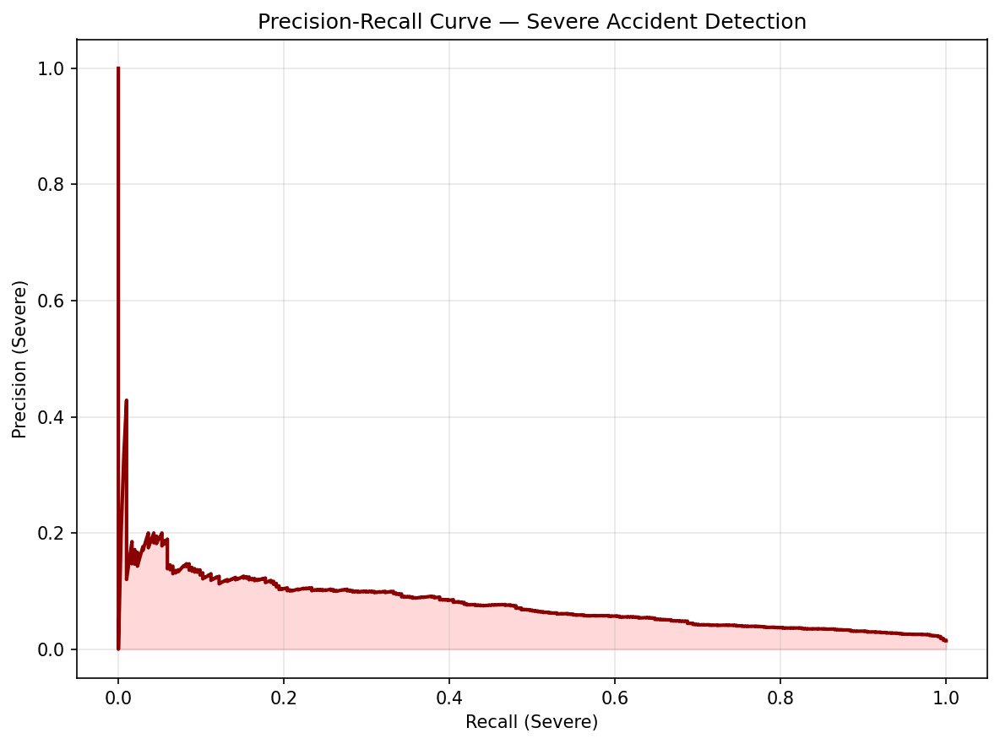
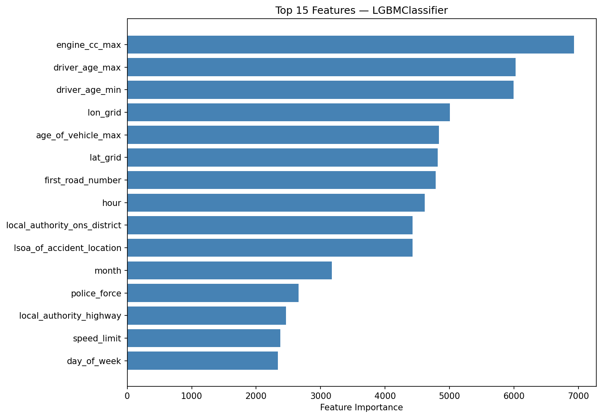

# UK Road Accident Severity Classification — Dual-Strategy Approach (2023)

[](https://github.com/ansingh16/UK_road_safety_modelling/actions/workflows/ci.yml)

Predicting the severity of UK road collisions from **Department for Transport (DfT)
2023 road safety data**, using two complementary models tuned for different
real-world objectives:

* **Severe-optimized model** (LogisticRegression with heavy class weighting) —
  catches as many severe/fatal collisions as possible, accepting a high false-alarm
  rate. Built for triage settings where a missed severe case is far costlier than a
  false positive.
* **Balanced model** (RandomForest) — maximises overall accuracy and macro recall
  across all three severity levels, for general traffic-management and resource
  planning.

Severe collisions are only ~1.4% of the data, so the core challenge is **extreme
class imbalance**, addressed with SMOTE / ADASYN / SMOTE+Tomek resampling, custom
class weights, and probability-threshold optimization.

## 📊 Results

Measured on the held-out 20% test split — **20,852 collisions** (304 severe,
4,688 serious, 15,860 slight). Reproduce with `python scripts/generate_results.py`
(writes [`results/metrics.md`](results/metrics.md) and the plots below).

| Metric | Severe-Optimized (LogReg) | Balanced (RandomForest) |
|--------|---------------------------|-------------------------|
| Severe recall | **0.977** | 0.868 |
| Severe precision | 0.033 | **0.120** |
| Macro recall | 0.619 | **0.809** |
| Overall accuracy | 0.338 | **0.839** |

**How to read this:** the severe-optimized model recovers **97.7%** of severe
collisions — but at very low precision, so it floods the operator with false
alarms (low overall accuracy). The balanced model is far more accurate overall
and still recovers **86.8%** of severe cases. The right model depends on the cost
of a missed severe collision versus the cost of a false alarm.

### Visuals

| | |
|---|---|
|  |  |
|  |  |

## 📥 Data

The 2023 road safety data is publicly available from the DfT:
https://www.data.gov.uk/dataset/cb7ae6f0-4be6-4935-9277-47e5ce24a11f/road-safety-data

Place the collision (and optionally vehicle / casualty) CSVs in `data/`. The
shipped models are trained on the **collision** table only (36 features); set
`merge_vehicles=True` in `load_dft_data` to also join the vehicle table.

* **Collisions 2023** — accident details, location, conditions, timing
* **Vehicles 2023** — vehicle characteristics, manoeuvres, damage
* **Casualties 2023** — injury severity, demographics, roles

## 🛠 Tech Stack

* **Python** — data pipeline and modelling
* **scikit-learn** — LogisticRegression, RandomForest, metrics, scaling
* **imbalanced-learn** — SMOTE, ADASYN, SMOTE+Tomek, RandomUnderSampler
* **LightGBM** — optional gradient-boosting backend (`pip install -e ".[lightgbm]"`)
* **pandas / NumPy** — preprocessing and feature engineering
* **Matplotlib / Seaborn** — evaluation plots
* **joblib** — model serialization

## 📂 Project Structure

```
UK_road_safety_modelling/
├── src/uk_road_safety/      # Installable package
│   ├── data.py              # DfT CSV loading, encoding, imputation, split
│   ├── models.py            # Sampling strategies + model training
│   ├── evaluate.py          # Metrics, threshold optimization, plots
│   └── predict.py           # Load artifacts + predict severity
├── configs/                 # emergency.yaml / balanced.yaml strategies
├── scripts/
│   └── generate_results.py  # Regenerate metrics table + evaluation plots
├── tests/                   # pytest suite (data / models / evaluate)
├── results/                 # Generated metrics.md and plots
├── notebooks/               # Original exploration notebooks
├── models/                  # Trained model pickles (gitignored)
├── data/                    # DfT CSV files (gitignored)
└── pyproject.toml
```

## 🚀 How to Run

```bash
git clone https://github.com/ansingh16/UK_road_safety_modelling.git
cd UK_road_safety_modelling
pip install -e ".[lightgbm,dev]"
```

* **Regenerate results:** `python scripts/generate_results.py --data-dir data/ --model-dir models/`
* **Run the tests:** `pytest`

The original end-to-end exploration lives in the notebooks:

1. `notebooks/Data_Wrangling.ipynb` — loads, merges, and preprocesses the DfT CSVs
2. `notebooks/Data_Modelling.ipynb` — trains both models, evaluates, saves artifacts
